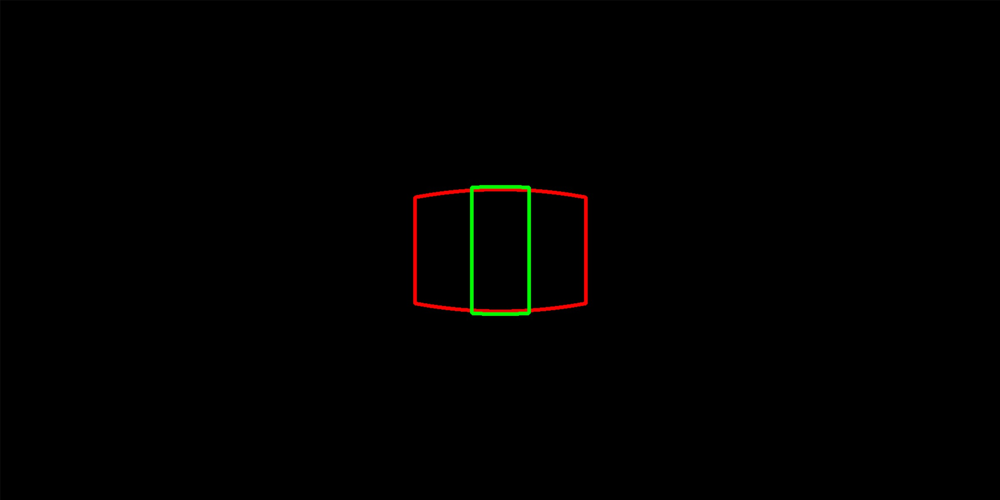
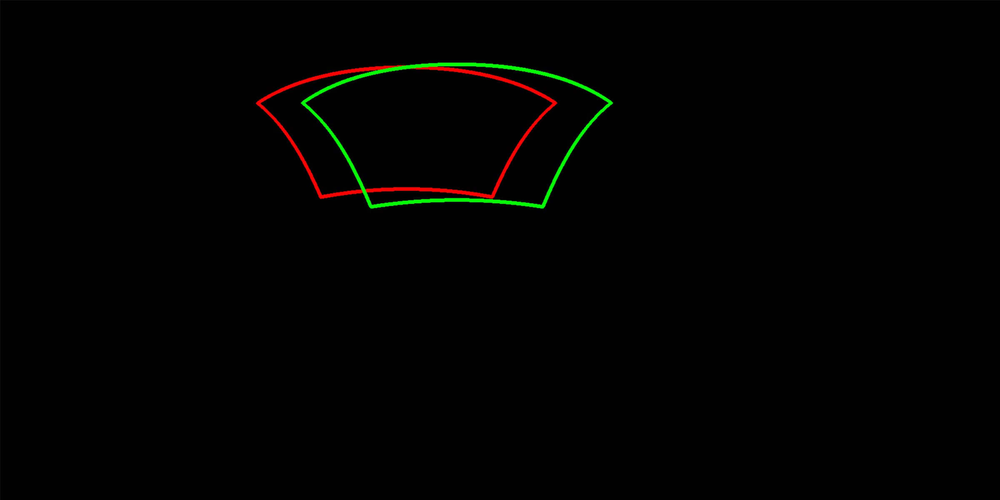
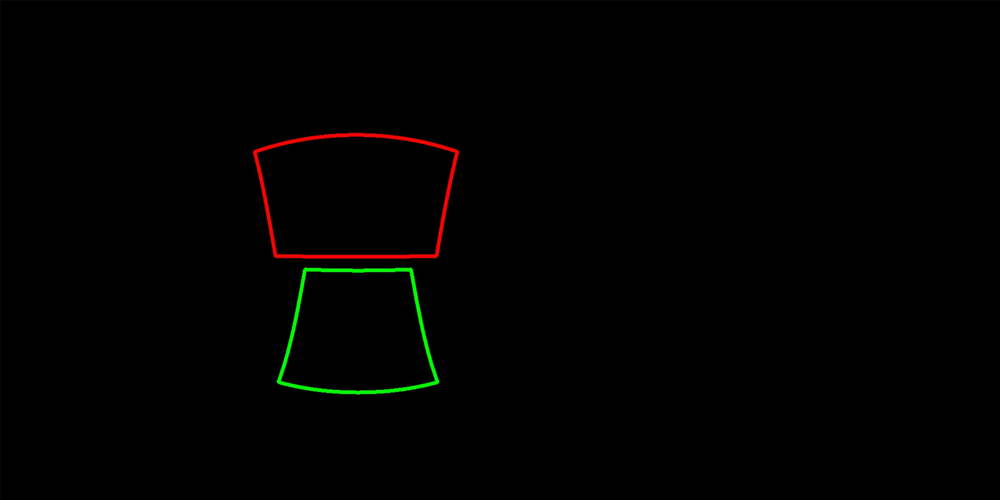
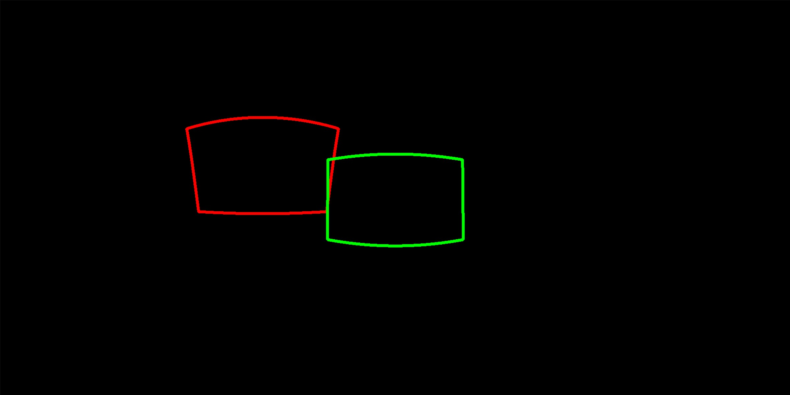

# Spherical Image Object Detection
<p align="center">

</p>

# Unbiased Spherical IoU

**Unbiased IoU for Spherical Image Object Detection**<br>
Feng Dai, Bin Chen, Hang Xu, Yike Ma, Xiaodong Li, Bailan Feng, Peng Yuan, Chenggang Yan, Qiang Zhao*.<br>
AAAI Conference on Artificial Intelligence (AAAI), 2022. Paper Link:  [arXiv](https://arxiv.org/abs/2108.08029).


## Algorithms

Our **Unbiased Spherical IoU** first calculates the area of each spherical rectangle, then calculates the intersection area of the two spherical rectangles. Finally, we compute the spherical IoU.

**First**, the area of each spherical rectangle can be computed according to the following formula. (The derivation is given in the supplementary material of our paper.)

<p align="center">

</p>

**Second**, the computation of intersection area contains 3 steps:

- Step 1. Compute intersection points between boundaries of the two spherical rectangles.

- Step 2. Remove unnecessary points by two sub-steps:
  - Sub-step 1: Remove points outside the two spherical rectangles.
  - Sub-step 2: Remove redundant Points. (This step is not required for most cases.)

- Step 3. Compute all angles and the final intersection area.

**Finally**, the spherical IoU is computed by the following formula

<p align="center">

</p>

## Examples

|  |  |  |
| :--------------------------------: | :--------------------------------: | :--------------------------------: |
|   *Example 1:*  IoU = 0.34272136   |   *Example 2:*  IoU = 0.58728738   |      *Example 3:*  IoU = 0.0       |
|  |  |  |
|   *Example 4:*  IoU = 0.00521955   |   *Example 5:*  IoU = 0.79667179   |   *Example 6:*  IoU = 0.00049333   |

* For example 1-3, the IoU can be easily calculated by our algorithm without loop-detection process in Sub-step 2 (Step 2) of the intersection area computation algorithm.
* For example 4-6, these examples have at least 3 edges intersect at the same point, or even edges overlap. We need a loop detection algorithm to find the real points, which is a  process of finding a closed loop by DFS algorithm, but these cases are rarely in evaluation or training. The computation cost is negligible. 

**Note:**  We just release the code for unbiased spherical IoU calculation without loop detection. If you are interested in the full version, please contact the authors. 

## Comparisons with Existing Biased Methods
<p align="center">

</p>

* The IoUs computed with different methods for three cases (Resolution: 1024×512). Here spherical integral by numerical integration is taken as the reference method. The differences are listed between each method and the reference method.
* Note that the spherical integral by numerical integration method will be degraded if we use unrolled spherical images with low resolution. It is also time-consuming, which takes 37.5ms for IoU calculation, while our method (Unbiased IoU) is much faster and only needs 0.99ms at the same resolution (1024×512).


## Prerequisites

- Python ≥ 3.6
- Numpy==1.16.5 (We use this version. Other versions may be also applicable.)
- Opencv-python == 4.5.1.48 (Optional for results visualization.)

## Usage

Some examples are given in `main.py` (*pred* and *gt*), and run the following command for demonstration.

```python
python main.py
```

The iou computation matrix will be calculated.

Note that the format of the input spherical rectangle and the input of the function of our unbiased IoU is different, thus `transFormat` is used to change the format.

```python
The input format for pred and gt (angles)
    [center_x, center_y, fov_x, fov_y]
        center_x : [-180, 180]
        center_y : [90, -90]
        fov_x    : [0, 180]
        fov_y    : [0, 180]
The input format for our unbiased IoU: (radians)
	[center_x, center_y, fov_x, fov_y]
        center_x : [0, 360]
        center_y : [0, 180]
        fov_x    : [0, 180]
        fov_y    : [0, 180]
```

If you do not want to see the visualization of the spherical rectangles, remove the call to `drawSphBBox`.

<!-- ## Citing Our Work -->

## Citing the Unbiased Spherical IoU

If you use our Unbiased IoU in your research, please cite our paper as

```BibTeX
@inproceedings{SphIoU,
  title={Unbiased IoU for Spherical Image Object Detection},
  author={Dai, Feng and Chen, Bin and Xu, Hang and Ma, Yike and Li, Xiaodong and Feng, Bailan and Yan, Chenggang and Zhao, Qiang},
  booktitle={Proceedings of AAAI Conference on Artificial Intelligence},
  year={2022}
}
```
